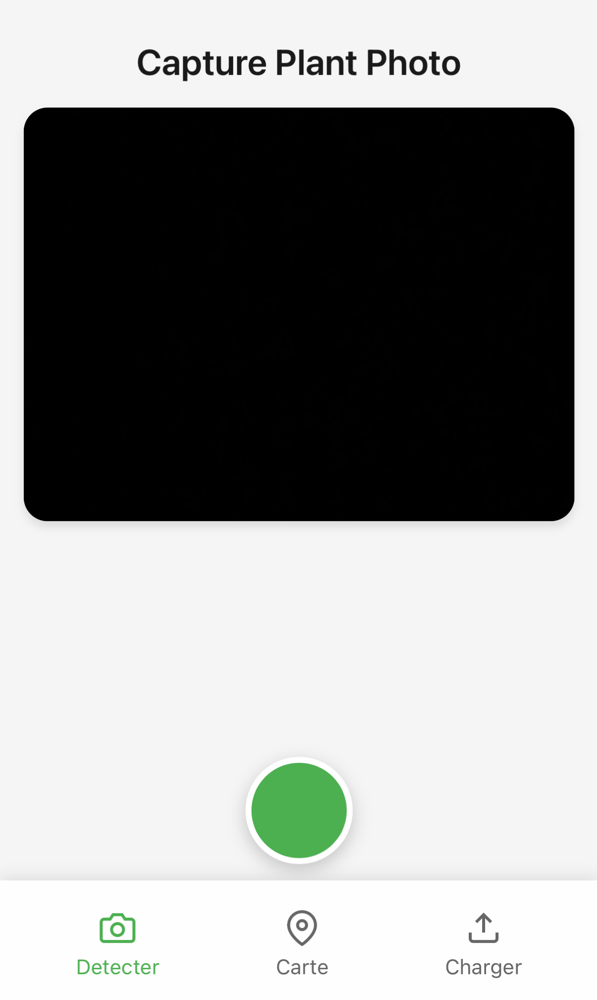
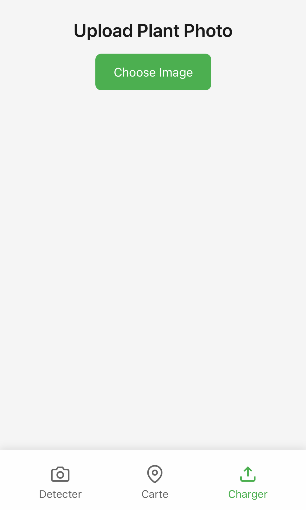

# 🌿 Invasiv'Tracker

<div align="center">
  
  ### AI-Powered Invasive Species Detection & Monitoring System
  
  [](https://reactjs.org/)
  [](https://www.typescriptlang.org/)
  [](https://nodejs.org/)
  [](https://www.postgresql.org/)
  [](https://leafletjs.com/)
  [](https://plantnet.org/)
  
  **A Saint-Étienne-based startup solution for environmental conservation**
  
</div>

---

## 📋 Overview

**Invasive Plant Tracker** is an innovative mobile-first web application designed to simplify and automate the detection, identification, and tracking of invasive plant species. Built for environmental agencies, conservation organizations, and field researchers, this solution combines cutting-edge AI image recognition with geospatial mapping to combat the spread of invasive flora.

### 🎯 Mission

Empower environmental professionals and citizen scientists to:
- **Identify** invasive plant species instantly using smartphone cameras
- **Track** the geographic distribution of invasive species in real-time
- **Monitor** ecosystem health through comprehensive data visualization
- **Collaborate** on conservation efforts with centralized data collection

---

## ✨ Key Features

### 📸 AI-Powered Image Recognition
- **Instant Identification** - Capture or upload plant photos for immediate analysis
- **PlantNet Integration** - Leverages PlantNet's extensive botanical database (10+ species matches)
- **High Accuracy** - Advanced machine learning algorithms with confidence scoring
- **Multi-Organ Detection** - Analyzes leaves, flowers, fruits, and bark automatically

### 📍 Geolocation Intelligence
- **GPS Tracking** - Automatic location capture with each identification
- **Precision Mapping** - Coordinates rounded to ~111m accuracy for privacy
- **EXIF Data Extraction** - Reads location metadata from uploaded images
- **Offline Capability** - Stores data locally when network unavailable

### 🗺️ Interactive Mapping System
- **Real-Time Visualization** - View all identified plants on an interactive map
- **Family-Based Clustering** - Color-coded markers by plant family
- **Heat Maps** - Identify invasion hotspots and concentration areas
- **Filter & Search** - Query by species, family, or geographic region
- **Zoom Controls** - Navigate from regional to street-level views

### 🔍 Invasive Species Database
- **65+ Invasive Species** - Comprehensive French invasive plant registry
- **Scientific Classification** - Complete taxonomic information (family, genus, species)
- **Common Names** - Multi-language support (French common names included)
- **Validation System** - Cross-reference with official invasive species lists

---

## 🖼️ Application Screenshots

### 📷 Camera Capture Interface


*Mobile-optimized camera interface with instant capture and geolocation*

### 📤 Upload & Analysis


*Upload existing photos with automatic EXIF data extraction*

### 🗺️ Interactive Map View


*Comprehensive mapping interface with family-based color coding and legend*

---

## 🏗️ Architecture

### Tech Stack

#### Frontend
- **React 18.3** - Modern component-based UI
- **TypeScript 5.6** - Type-safe development
- **Vite** - Lightning-fast build tool and HMR
- **React Router DOM 7.0** - Client-side routing
- **Leaflet 1.9** - Interactive mapping library
- **React Leaflet 4.2** - React bindings for Leaflet
- **Material-UI (MUI) 6.1** - Professional UI components
- **Styled Components 6.1** - CSS-in-JS styling
- **Exifr 7.1** - EXIF metadata extraction

#### Backend
- **Node.js** - JavaScript runtime
- **Express 4.21** - Web application framework
- **TypeScript** - Type-safe server code
- **PostgreSQL 8.13** - Relational database
- **Multer** - Multipart/form-data handling
- **Axios** - HTTP client for API calls
- **Form-Data** - Multipart form data construction

#### External APIs
- **PlantNet API** - Plant identification service
- **OpenStreetMap** - Base map tiles via Leaflet

#### DevOps
- **Docker** - Containerization
- **Docker Compose** - Multi-container orchestration
- **ts-node** - TypeScript execution
- **Nodemon** - Development auto-reload

---

## 🚀 Quick Start

### Prerequisites

- **Docker & Docker Compose** (recommended)
- **Node.js 18+** (for local development)
- **PostgreSQL 15+** (for local development)
- **PlantNet API Key** (required for plant identification)

### 🐳 Docker Deployment (Recommended)

```bash
# Clone the repository
git clone <repository-url>
cd invasiv-plant-tracker

# Start backend services
cd backend
docker-compose up --build

# The backend will be available at http://localhost:3000
```

### 💻 Local Development Setup

#### Backend Setup

```bash
cd backend

# Install dependencies
npm install

# Set up PostgreSQL database
# Create a database named 'invasive_plants'
createdb invasive_plants

# Run database initialization script
psql -d invasive_plants -f db-script/db-script.sql

# Start development server
npm run dev

# Backend runs on http://localhost:3000
```

#### Frontend Setup

```bash
cd invasiv-plant-tracker-front/frontend

# Install dependencies
npm install

# Configure environment variables
# Create .env file with:
# VITE_API_URL=http://localhost:3000

# Start development server
npm run dev

# Frontend runs on http://localhost:5173
```

---

## 📡 API Documentation

### Base URL
```
http://localhost:3000
```

### Endpoints

#### Plant Identification

**POST** `/process-image`

Upload an image for plant identification.

**Request:**
- Content-Type: `multipart/form-data`
- Body:
  - `images`: Image file (JPEG/PNG)
  - `latitude`: GPS latitude (decimal)
  - `longitude`: GPS longitude (decimal)

**Response:**
```json
{
  "status": "identified",
  "results": [
    {
      "score": 0.95,
      "species": {
        "scientificName": "Ailanthus altissima",
        "family": {
          "scientificName": "Simaroubaceae"
        }
      },
      "images": [
        {
          "url": {
            "m": "https://..."
          }
        }
      ]
    }
  ],
  "latitude": 45.439,
  "longitude": 4.387
}
```

#### Validate Match

**POST** `/validate-match`

Validate and store a plant identification result.

**Request:**
```json
{
  "scientificName": "Ailanthus altissima",
  "latitude": 45.439,
  "longitude": 4.387,
  "imageUrl": "https://..."
}
```

**Response:**
```json
{
  "status": "success",
  "name": "Ailanthus altissima",
  "isInvasiv": true,
  "latitude": 45.439,
  "longitude": 4.387,
  "imgUrl": "https://...",
  "family": "Simaroubaceae"
}
```

#### Get Invasive Plant Info

**GET** `/invasiv-info`

Retrieve all stored invasive plant identifications.

**Response:**
```json
[
  {
    "id": 1,
    "name": "Ailanthus altissima",
    "probability": 0.95,
    "is_invasive": true,
    "latitude": 45.439,
    "longitude": 4.387,
    "img_url": "https://...",
    "family": "Simaroubaceae"
  }
]
```

---

## 🗂️ Project Structure

```
invasiv-plant-tracker/
├── backend/                        # Node.js/Express API
│   ├── src/
│   │   ├── server.ts              # Express server setup
│   │   ├── controller/
│   │   │   ├── controller.procces-image.ts    # Image processing logic
│   │   │   └── controller.getInvasivInfo.ts   # Data retrieval
│   │   ├── database/
│   │   │   └── connect.ts         # PostgreSQL connection
│   │   ├── middleware/
│   │   │   └── cors.ts            # CORS configuration
│   │   ├── routes/
│   │   │   └── index.ts           # API routing
│   │   └── mockData/
│   │       └── apiResponse.ts     # Mock data for testing
│   ├── db-script/
│   │   └── db-script.sql          # Database schema & seed data
│   ├── package.json               # Node dependencies
│   ├── tsconfig.json              # TypeScript config
│   ├── backend.dockerfile         # Backend container
│   └── docker-compose.yaml        # Multi-container setup
│
├── invasiv-plant-tracker-front/   # React TypeScript SPA
│   ├── frontend/
│   │   ├── src/
│   │   │   ├── components/
│   │   │   │   ├── CameraCpture.tsx       # Camera interface
│   │   │   │   ├── UploadImage.tsx        # Image upload
│   │   │   │   ├── Map.tsx                # Leaflet map
│   │   │   │   ├── PlantMatchesView.tsx   # Results display
│   │   │   │   ├── PlantInfo.tsx          # Species details
│   │   │   │   ├── Legend.tsx             # Map legend
│   │   │   │   ├── Modal.tsx              # Modal dialogs
│   │   │   │   └── Navigation.tsx         # Bottom navigation
│   │   │   ├── logic/
│   │   │   │   └── process_img.ts         # Image processing
│   │   │   ├── types/
│   │   │   │   └── fetchedInfosType.ts    # TypeScript types
│   │   │   ├── App.tsx                    # Main component
│   │   │   └── main.tsx                   # Entry point
│   │   ├── package.json           # Node dependencies
│   │   └── vite.config.ts         # Vite configuration
│   ├── screens/                   # Application screenshots
│   └── README.md
│
└── README.md                      # This file
```

---

## 🌍 Invasive Species Database

The application includes a comprehensive database of **65+ invasive plant species** documented in France, including:

### Featured Invasive Species

| Scientific Name | Common Name (French) | Family |
|----------------|---------------------|---------|
| **Ailanthus altissima** | Ailante glanduleux | Simaroubaceae |
| **Reynoutria japonica** | Renouée du Japon | Polygonaceae |
| **Ambrosia artemisiifolia** | Ambroisie à feuilles d'armoise | Asteraceae |
| **Ludwigia grandiflora** | Jussie à grandes fleurs | Onagraceae |
| **Robinia pseudoacacia** | Robinier faux-acacia | Fabaceae |
| **Buddleja davidii** | Arbre-aux-papillons | Scrophulariaceae |
| **Cortaderia selloana** | Herbe de la pampa | Poaceae |

### Plant Families Tracked

- **Fabaceae** (Fabacées) - Legumes
- **Asteraceae** (Astéracées) - Composites
- **Simaroubaceae** (Simaroubacées) - Quassia family
- **Polygonaceae** (Polygonacées) - Buckwheat family
- **Onagraceae** (Onagracées) - Evening primrose family
- **Scrophulariaceae** (Scrophulariacées) - Figwort family
- **Poaceae** (Poacées) - Grasses
- And many more...

---

## 🔒 Security & Privacy

- **GPS Precision Control** - Coordinates rounded to 3 decimal places (~111m)
- **CORS Protection** - Configured cross-origin resource sharing
- **Input Validation** - Server-side validation for all inputs
- **SQL Injection Prevention** - Parameterized queries
- **File Upload Limits** - Size and type restrictions
- **API Rate Limiting** - PlantNet API quota management
- **Error Handling** - Comprehensive error messages without exposing internals

---

## 🌟 Highlights for Recruiters

### Technical Excellence
- ✅ **Full-Stack TypeScript** - End-to-end type safety
- ✅ **Modern React Patterns** - Hooks, functional components, custom hooks
- ✅ **RESTful API Design** - Clean, documented endpoints
- ✅ **Geospatial Integration** - Advanced mapping with Leaflet
- ✅ **External API Integration** - PlantNet AI service
- ✅ **Mobile-First Design** - Responsive, touch-optimized interface
- ✅ **Real-Time Data** - Live map updates and synchronization

### Domain Expertise
- ✅ **Environmental Technology** - Conservation-focused solution
- ✅ **Computer Vision** - Image processing and analysis
- ✅ **GIS Integration** - Geographic information systems
- ✅ **Botanical Database** - Scientific classification system
- ✅ **Data Visualization** - Interactive maps and charts
- ✅ **Mobile UX** - Camera integration and geolocation

### Best Practices
- ✅ **Clean Architecture** - Separation of concerns
- ✅ **Type Safety** - TypeScript throughout
- ✅ **Error Handling** - Comprehensive error management
- ✅ **Code Organization** - Modular, maintainable structure
- ✅ **Documentation** - Clear README and code comments
- ✅ **Docker Ready** - Containerized deployment

---

## 📈 Use Cases

### 🏛️ Environmental Agencies
- Monitor invasive species spread across regions
- Generate reports for conservation planning
- Track intervention effectiveness over time
- Coordinate multi-site management efforts

### 🎓 Research Institutions
- Collect field data for ecological studies
- Build comprehensive species distribution maps
- Analyze invasion patterns and trends
- Collaborate on citizen science projects

### 🌳 Conservation Organizations
- Rapid assessment of natural areas
- Prioritize removal and control efforts
- Document biodiversity threats
- Educate volunteers and staff

### 👥 Citizen Scientists
- Contribute to environmental monitoring
- Learn about local invasive species
- Report sightings to authorities
- Participate in community conservation

---

## 🚀 Future Enhancements

- [ ] **Offline Mode** - Full functionality without internet
- [ ] **User Authentication** - Personal accounts and data management
- [ ] **Advanced Analytics** - Trend analysis and predictive modeling
- [ ] **Multi-Language Support** - English, Spanish, German interfaces
- [ ] **Native Mobile Apps** - iOS and Android applications
- [ ] **Export Functionality** - CSV, GeoJSON, KML formats
- [ ] **Notification System** - Alerts for new invasions in areas of interest
- [ ] **Community Features** - User comments, ratings, and discussions
- [ ] **Integration APIs** - Connect with other environmental databases
- [ ] **Machine Learning** - Custom model training for regional species

---

## 🤝 Contributing

Contributions are welcome! This project supports environmental conservation efforts.

### How to Contribute

1. **Fork** the repository
2. **Create** a feature branch (`git checkout -b feature/AmazingFeature`)
3. **Commit** your changes (`git commit -m 'Add some AmazingFeature'`)
4. **Push** to the branch (`git push origin feature/AmazingFeature`)
5. **Open** a Pull Request

### Development Guidelines
- **TypeScript**: Maintain type safety throughout
- **Code Style**: Follow ESLint and Prettier configurations
- **Testing**: Add tests for new features
- **Documentation**: Update README for significant changes
- **Commits**: Use conventional commit format

---

## 📚 Resources

- [PlantNet API Documentation](https://my.plantnet.org/usage)
- [Leaflet Documentation](https://leafletjs.com/reference.html)
- [React Leaflet Guide](https://react-leaflet.js.org/)
- [PostgreSQL Documentation](https://www.postgresql.org/docs/)
- [French Invasive Species Database](https://www.gt-ibma.eu/)

---

## 🌱 Environmental Impact

This application contributes to:
- **Biodiversity Protection** - Early detection of invasive threats
- **Ecosystem Preservation** - Data-driven conservation strategies
- **Public Awareness** - Education about invasive species
- **Scientific Research** - Open data for ecological studies
- **Sustainable Management** - Efficient resource allocation

---

<div align="center">
  
### ⭐ If you find this project valuable for environmental conservation, please consider giving it a star!

**Built with passion for protecting our ecosystems**

*Developed in Saint-Étienne, France 🇫🇷*

</div>
